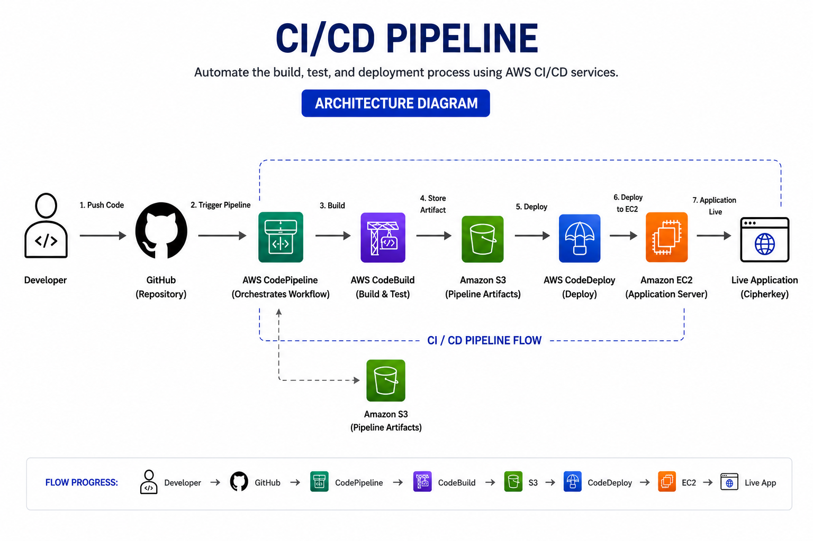
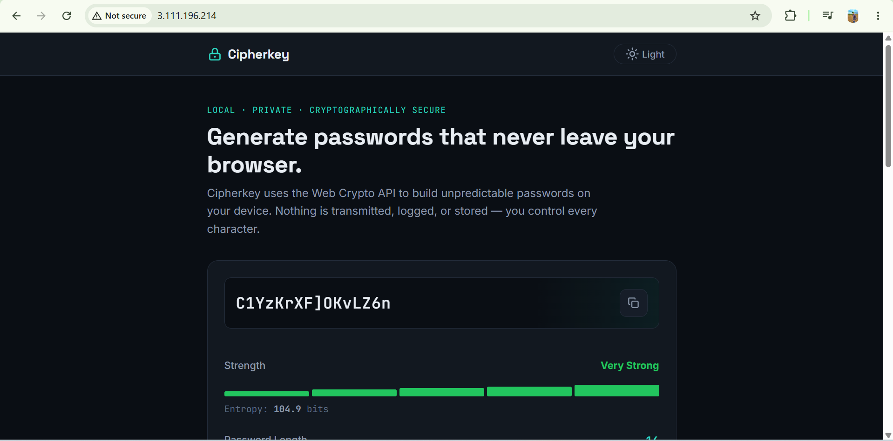
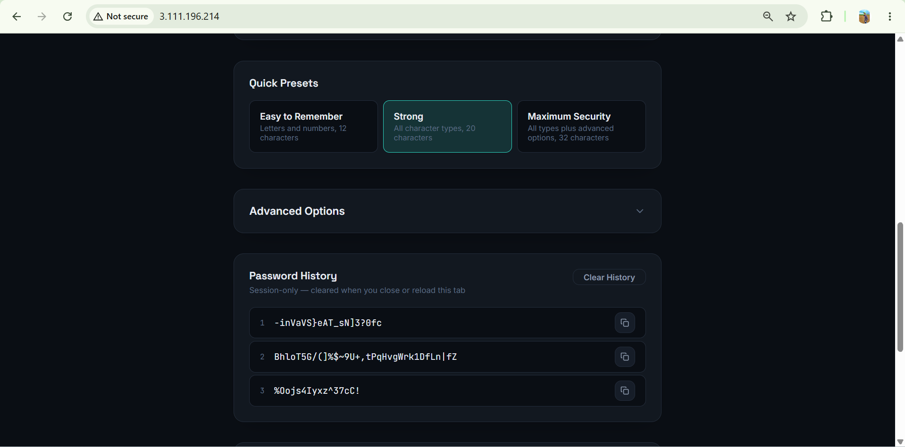
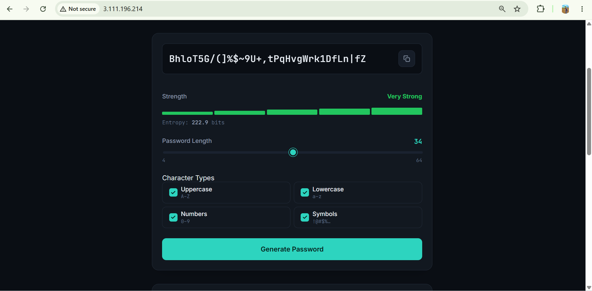
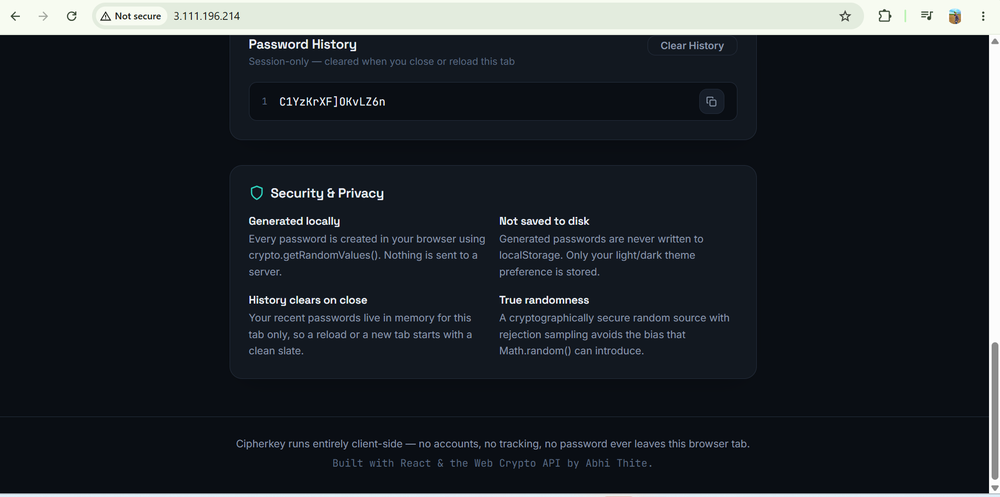
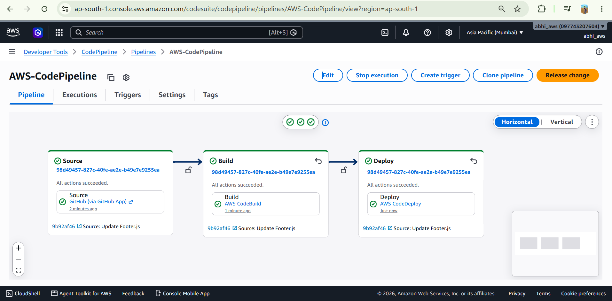
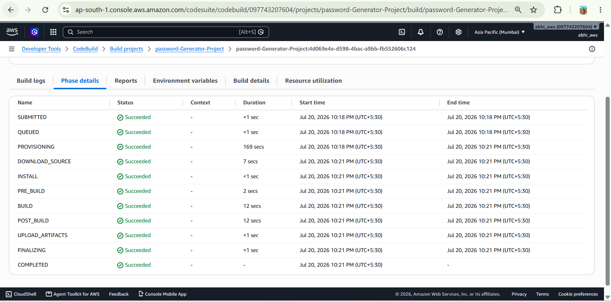
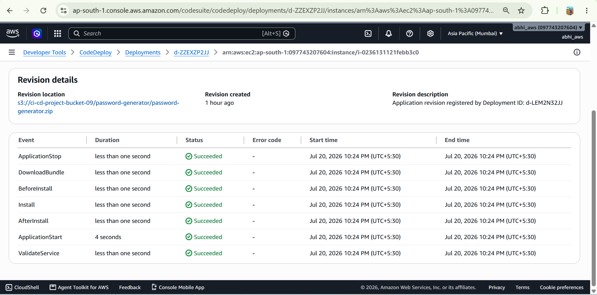

# 🔐 Cipherkey — Secure Password Generator with Automated AWS CI/CD

Cipherkey is a secure password generator built with **React**, **JavaScript (ES6+)**, and **plain CSS**. Passwords are generated entirely inside the browser using the **Web Crypto API**, so generated passwords are never transmitted to a server or stored persistently.

The application is containerized using **Docker** and deployed to **Amazon EC2** through an automated CI/CD pipeline using **GitHub, AWS CodePipeline, AWS CodeBuild, Amazon S3, and AWS CodeDeploy**.

---

## 🚀 Project Highlights

- 🔐 Cryptographically secure password generation using `crypto.getRandomValues()`
- 🎚️ Adjustable password length (4–64 characters)
- 🔤 Uppercase, lowercase, number, and symbol controls
- 📊 Password strength and entropy calculation
- 🕘 Session-only password history
- 🌗 Light and dark themes
- 🐳 Dockerized application deployment
- 🔄 Automated GitHub-to-AWS CI/CD workflow
- 🏗️ Automated builds using AWS CodeBuild
- 📦 Deployment artifacts stored in Amazon S3
- 🚀 Automated deployment using AWS CodeDeploy
- ☁️ Application hosted on Amazon EC2

---

### CI/CD Architecture Flow




## 📸 Project Screenshots

### Cipherkey Application Images









---

## 🚀 AWS CI/CD Pipeline

### AWS CodePipeline — Successful Source, Build & Deploy



### AWS CodeBuild — Successful Build



### AWS CodeDeploy — Successful EC2 Deployment




---

## 🔄 How the CI/CD Pipeline Works

### 1. Developer Pushes Code
The developer pushes application changes to the GitHub repository.

### 2. GitHub Triggers CodePipeline
AWS CodePipeline detects the source change through the GitHub integration and starts the CI/CD pipeline.

### 3. AWS CodeBuild
AWS CodeBuild downloads the source code and executes the instructions defined in `buildspec.yml` to prepare the application and deployment artifact.

### 4. Amazon S3
The deployment artifact/application revision is stored in Amazon S3 for the deployment stage.

### 5. AWS CodeDeploy
AWS CodeDeploy retrieves the application revision from Amazon S3 and executes the deployment lifecycle configured in `appspec.yml`.

The deployment lifecycle includes:

- ApplicationStop
- DownloadBundle
- BeforeInstall
- Install
- AfterInstall
- ApplicationStart
- ValidateService

### 6. Amazon EC2
The deployment scripts start the Dockerized Cipherkey application on Amazon EC2.

### Complete Flow

**GitHub → AWS CodePipeline → AWS CodeBuild → Amazon S3 → AWS CodeDeploy → Amazon EC2 → Live Application**

---

## ✨ Features

- 🔐 Cryptographically secure generation via `crypto.getRandomValues()`
- 🎚️ Adjustable length (4–64 characters)
- 🔤 Uppercase, lowercase, number, and symbol toggles
- 📋 One-click copy with visual feedback
- 🔁 Instant regeneration
- 📊 Live strength meter with a 5-level indicator
- 🧮 Entropy calculation in bits
- ⚡ Quick presets: Easy to Remember, Strong, Maximum Security
- ⚙️ Exclude similar characters
- ⚙️ Exclude ambiguous symbols
- ⚙️ Prevent consecutive repeats
- 🕘 Session-only password history
- 🌗 Light and dark themes
- 📱 Fully responsive interface
- ♿ Semantic HTML, ARIA labels, keyboard focus, and reduced-motion support

---

## 🔒 Security & Privacy

### Generated Locally
Passwords are created directly inside the browser using:

```javascript
crypto.getRandomValues()
```

Nothing is sent to a backend server.

### Not Saved to Disk
Generated passwords are never written to `localStorage`, databases, or backend storage.

### Session-Only History
Recent passwords exist only in React state for the current tab. Reloading or closing the tab clears the history.

### Theme Preference
Only the light/dark theme preference is stored in `localStorage`.

### Secure Randomness
Cipherkey uses the Web Crypto API rather than `Math.random()` and uses rejection sampling to avoid modulo bias.

---

## 🛠️ Tech Stack

### Application
- React 18
- JavaScript (ES6+)
- Vite 5
- HTML5
- Plain CSS
- Web Crypto API
- Clipboard API

### DevOps & AWS
- Git
- GitHub
- GitHub Actions (CI)
- Docker
- AWS CodePipeline
- AWS CodeBuild
- Amazon S3
- AWS CodeDeploy
- Amazon EC2
- AWS IAM

---

## 📂 Project Structure

```text
password-generator/
├── public/
├── scripts/
│   ├── start_container.sh
│   └── stop_container.sh
├── src/
│   ├── components/
│   │   ├── Header.jsx
│   │   ├── Hero.jsx
│   │   ├── PasswordDisplay.jsx
│   │   ├── PasswordOptions.jsx
│   │   ├── PasswordStrength.jsx
│   │   ├── PasswordPresets.jsx
│   │   ├── AdvancedOptions.jsx
│   │   ├── PasswordHistory.jsx
│   │   ├── SecurityInfo.jsx
│   │   └── Footer.jsx
│   ├── styles/
│   │   ├── global.css
│   │   └── components.css
│   ├── utils/
│   │   ├── passwordGenerator.js
│   │   └── passwordStrength.js
│   ├── App.jsx
│   └── main.jsx
├── .dockerignore
├── .gitignore
├── appspec.yml
├── buildspec.yml
├── Dockerfile
├── index.html
├── package-lock.json
├── package.json
├── README.md
└── vite.config.js
```

---

## ⚙️ CI/CD Configuration Files

### `buildspec.yml`
Defines the build instructions executed by AWS CodeBuild.

### `appspec.yml`
Defines the AWS CodeDeploy deployment configuration and lifecycle hooks.

### Deployment Scripts

```text
scripts/
├── start_container.sh
└── stop_container.sh
```

The scripts manage the Docker container lifecycle during automated deployments.

---


## 💻 Getting Started

### Prerequisites

- Node.js 14+
- npm 6+
- Git
- Docker

### Clone Repository

```bash
git clone https://github.com/AbhishekThite387/Cipherkey-Password-Generator.git
cd Cipherkey-Password-Generator
```

### Install Dependencies

```bash
npm install
```

### Run Development Server

```bash
npm run dev
```

### Production Build

```bash
npm run build
```

### Preview Production Build

```bash
npm run preview
```

---

## 🐳 Docker Deployment

### Build Image

```bash
docker build -t cipherkey .
```

### Run Container

```bash
docker run -d -p 80:80 --name cipherkey cipherkey
```

---

## 🔁 Automated Deployment Workflow

```text
1. Developer pushes code to GitHub
                  ↓
2. AWS CodePipeline detects the change
                  ↓
3. AWS CodeBuild builds/packages the application
                  ↓
4. Deployment artifact is stored in Amazon S3
                  ↓
5. AWS CodeDeploy retrieves the application revision
                  ↓
6. CodeDeploy executes deployment lifecycle scripts
                  ↓
7. Docker container is deployed/restarted on EC2
                  ↓
8. Updated Cipherkey application becomes live
```

---

## 🎯 What This Project Demonstrates

- Secure client-side application development
- Web Crypto API implementation
- React component architecture
- Docker containerization
- CI/CD pipeline implementation
- GitHub source integration
- AWS CodePipeline orchestration
- Automated builds using AWS CodeBuild
- Amazon S3 artifact management
- Automated EC2 deployments using AWS CodeDeploy
- CodeDeploy lifecycle hooks
- Automated deployment scripts

---

## 📄 License

Free to use for personal, educational, and portfolio purposes.
